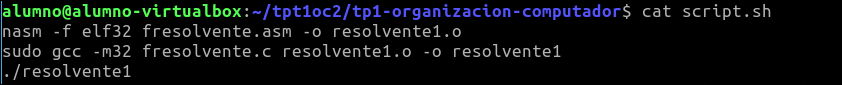
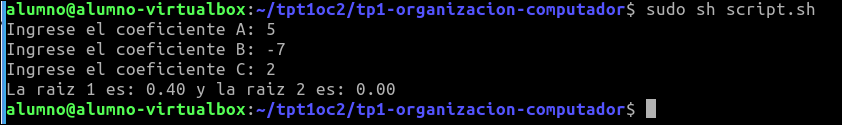

# tp1-organizacion-computador
Ejercicios de gestión de memoria, FPU, assembler

## Introducción
Para este trabajo práctico n°1 se pide realizar ejercicios obligatorios. Por un lado C y por el otro Assembler.
Se pide una formula resolvente en ASM. Desde C llamar esa función creada en ASM.
Se pide parametros a,b,c que los indica el usuarios.

## Probando
Tenemos que ejecutar un script que contiene todos los comandos.


## Explicación
* Convierte el asm a un objeto
* Se realiza el linkeo al objeto
* Ejecución del programa

## Al ejecutar...
```
sudo sh script.sh
```
Nos muestra la salida de la terminal.

